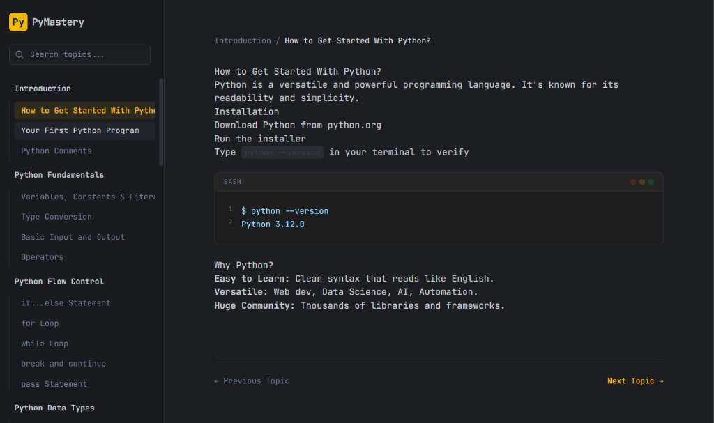

<div align="center">
  
  
  <h1 align="center" style="font-family: monospace; font-size: 4rem; margin-bottom: 0;">pytaste</h1>
  <p align="center" style="font-family: monospace; font-size: 1.2rem; color: #9ca3af;">
    <i>Simplest yet interactive Python tutorial platform.</i>
  </p>

  <br/>

  <!-- Tech Stack Badges -->
  <a href="https://www.python.org/">
    
  </a>
  <a href="https://react.dev/">
    
  </a>
  <a href="https://www.typescriptlang.org/">
    
  </a>
  <a href="https://vitejs.dev/">
    
  </a>

  <br/><br/>
</div>

> [!NOTE]
> **pytaste** is designed for the modern developer who learns by doing. It offers a distraction-free, terminal-inspired environment for mastering Python fundamentals.

<br/>

## `~/preview`
<div align="center">
  
</div>

<br/>

## `~/about`

**pytaste** reimagines the learning experience. It eschews the clutter of traditional LMS platforms in favor of a sleek, dark-mode aesthetic that feels like a professional IDE.

### **Features**
- **Terminal Aesthetic**: Clean, dark interface (`#1e2022`) with high-contrast Amber (`#fbbf24`) accents.
- **Interactive Code**: Syntax highlighting powered by PrismJS with specific theme adjustments.
- **Type-Safe**: Built entirely in TypeScript for robustness.
- **Blazing Fast**: Powered by Vite and React 19.

<br/>

## `~/installation`

Get up and running in seconds.

```bash
# 1. Clone the repository
git clone https://github.com/your-username/pytaste.git

# 2. Navigate to project root
cd pytaste

# 3. Install dependencies
npm install

# 4. Start the development server
npm run dev
```

<br/>

## `~/tech-stack-details`

| Component | Technology | Version | Description |
|:---|:---|:---|:---|
| **Frontend Framework** | `React` | `^19.0` | Server Components & Actions ready |
| **Build Tool** | `Vite` | `^6.0` | Next-generation frontend tooling |
| **Language** | `TypeScript` | `~5.8` | Strictly typed JavaScript |
| **Styling** | `Tailwind CSS` | `v3.x` | Utility-first CSS framework |
| **Typography** | `JetBrains Mono` | -- | A typeface for developers |
| **Data** | `JSON/Markdown` | -- | Lightweight content management |

<br/>

## `~/project-structure`

```bash
pytaste/
├── src/
│   ├── components/    # UI Components (Sidebar, ContentArea, etc.)
│   ├── data/          # Tutorial content and curriculum
│   ├── services/      # Business logic and state management
│   ├── App.tsx        # Main application entry
│   └── main.tsx       # React DOM rendering
├── public/            # Static assets
└── index.html         # Entry HTML with Tailwind config
```

<br/>

<div align="center">
  
</div>
